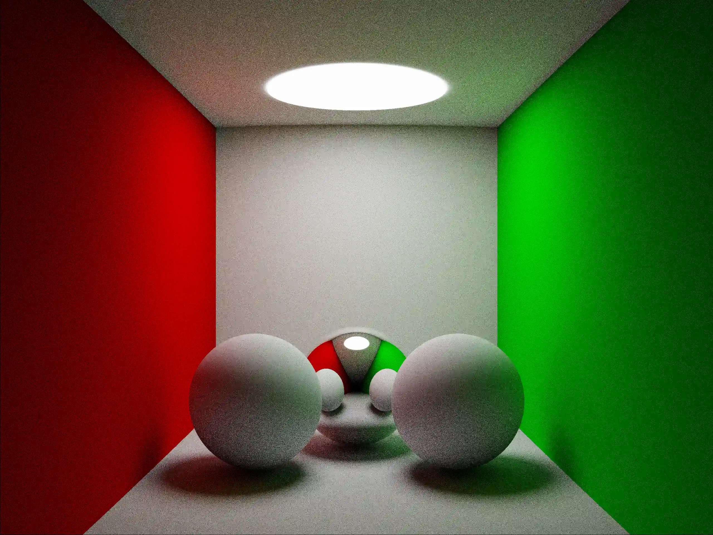
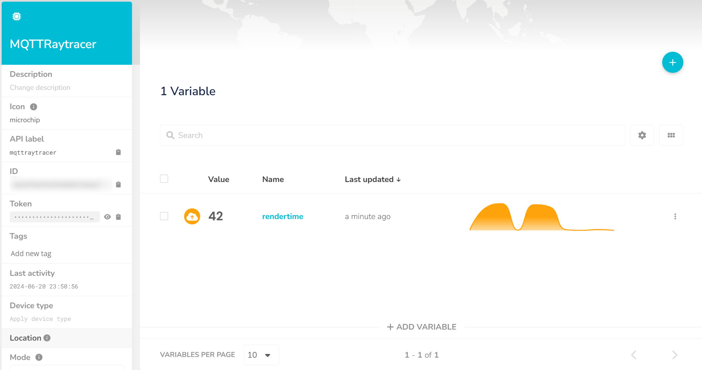

# Prismatica: A C++ global illumination renderer


Prismatica is a rudimentary, yet fully functional renderer written in C++. To achieve photorealistic renders,
Prismatica implements a rendering technique called Monte-Carlo path tracing. 

Prismatica leverages multithreading to accelerate the path tracer. As of writing, it only supports perfectly diffuse (Lambertian) or perfectly specular materials. Moreover, the image is outputted as a portable network graphic. Using a compatible viewer to view the rendered image is advised.

## Features
Prismatica includes the following features:
- Perfectly diffuse materials
- Perfectly reflective materials
- Reflective caustics
- Cylindrical camera projection
- Benchmark Mode: Publish render time to an MQTT broker

## Implementation details

Prismatica's multithreaded execution sequence starts with the initialization, followed by the dispatch
of ```n``` threads responsible for rendering the image. Afterwards, the threads are joined to ensure synchronization. In order to provide visual output to the user, the resulting image is saved as a portable network graphic. Further described in subsection "MQTT Mode", the time it took the render the image is published to an MQTT broker.

<p align="center">
  
</p>

To facilitate multithreading, the screen - a grid of pixels - is divided into multiple strips. Assuming ```n``` threads results in ```n``` strips. The following example elucidates the allocation of strips (hereafter referred to as "tiles") with 4 threads:

<p align="center">
  
</p>

Each thread executes the ```DispatchTile()``` function, which renders a strip of the scene using ```Render()```.
For each pixel, a total of 3 GI rays are dispatched. Keen readers will have noticed the absence of reflection rays, which were not given dedicated rays.
Instead, reflection rays are implemented recursively into the ```RayTraceScene()``` function.

The ```DispatchTile()```-function is outlined below:

<p align="center">
  
</p>

Once again, keen readers will notice that the path tracer does not gather light recursively, presenting
a moot point in the implementation. Therefore, the amount of light bounces bear a hard limit of 2 presently.

To enhance visual quality and aesthetics, the linear image (cd/m^2) is tonemapped and then converted into the sRGB color space. This ensures correct colors and pleasing aesthetics.  The utilized tonemap stems from [here.](https://knarkowicz.wordpress.com/2016/01/06/aces-filmic-tone-mapping-curve/)

## Compilation

Prismatica is to be compiled in conjunction with CMake, which will automatically generate 
the required build files for your platform.

### Dependencies
- C++ STL
- STB for image writes (included in /external/)
- GLM for mathematics (included in /external/)
- [paho.mqtt.cpp](https://github.com/eclipse/paho.mqtt.cpp) when using Benchmark Mode (see next section)

### Benchmark Mode

As part of an assignment during an _automation technology_ course, an extension pertaining to MQTT was developed.
Said extension publishes the time it took to render the image to an MQTT broker.

_But why?_, you might ask. Well, picture yourself having a fight with your friends over who has the best CPU. Now, you could simply compare the benchmark results from obscure websites, but where's the fun in that?

Let's turn **this** into a benchmark. To facilitate this, a string containing a unique, CPU-specific ID in conjuction with the time it took the render the image should be published to the broker.

Presently, only the latter is implemented. Getting strings describing the CPU model requires a plethora of platform-specific function calls, which are - for all intents and purposes - undesirable.
Compile with ```-DBUILD_MQTT=TRUE``` for benchmark mode. Requires libpaho-mqttpp.

## Showcase

Running prismatica will yield the following image:



And generate the following stdoutput:

```
[RENDERER]      Tiles: 16 Tile Height: 16
[RENDERER]      Dispatching tile with ID: 0
[RENDERER]      Dispatching tile with ID: 1
[RENDERER]      Dispatching tile with ID: 3
[RENDERER]      Dispatching tile with ID: 4
[RENDERER]      Wrote 196608 elements
[RENDERER]      Execution took 42ms
[MQTT]          Connecting to the broker
[MQTT]          Connection successful
[MQTT]          Disconnecting
```

The render time is uploaded to an mqtt broker, i.e. ubidots:

